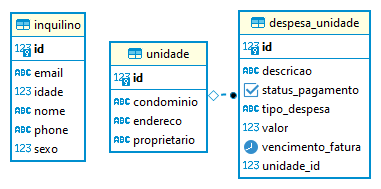

O projeto foi desenvolvido no formato de uma REST API, utilizando spring boot como framework, 
postgres como banco de dados e springdoc-openapi para gerar a documentação 
(http://localhost:8080/swagger-ui/index.html#/).
    Para rodar o projeto basta ter postgres instalado (https://www.postgresql.org/download/) 
e configurar o application.properties com o username e password. 
    Modelagem de banco de dados: 